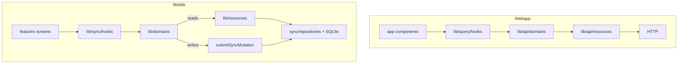

# Mobile `lib/` data layers

Mobile tier-1 CRM data is **local-first** (SQLite + sync outbox). Tier-2/3 use HTTP via `lib/api/`.

## Layer map (webapp ↔ mobile)

| Webapp | Mobile | Responsibility |
|--------|--------|----------------|
| `lib/api/resources/*` | `lib/resources/*` | List params, row mappers, SQL fragments — **no React, no I/O** |
| `lib/api/domains/*` | `lib/domains/*` | Public CRUD API (web: `async` + HTTP; mobile: **sync** + `submitSyncMutation`) |
| `lib/query/hooks/*` | `lib/sync/hooks/*` | UI subscription boundary (`useSyncQuery` ≈ TanStack `useQuery`) |
| `clientApiJson` / `serverApiJson` | `lib/api/client.ts`, `online-only.ts` | Tier-2/3 REST only |
| — | `lib/sync/*` | Pull, outbox, materializers (mobile-only) |
| — | `lib/sync/repositories/*` | Thin SQLite execution (imports `lib/resources`) |



**Invalidation:** webapp calls `invalidateQueries`; mobile bumps `SyncProvider.revision` (same intent, different mechanism).

## Import policy

| From `features/**` | Allowed |
|--------------------|---------|
| `lib/sync/hooks/*` | Tier-1 **reads** (including imperative `readContactsList` for paginated lists) |
| `lib/domains/*` | Tier-1 **writes** (`createContact`, `updateContact`, …) |
| `lib/api/*` | Tier-2/3 only (settings, photos, geocode, share) |
| `lib/sync/repositories/*` | **Never** — use domains or hooks |

## Adding a tier-1 entity

1. API domain + `emitSyncBatch` (see [sync-architecture.md](../../../.agents/skills/bondery-specific/references/api/sync-architecture.md))
2. Mobile materializer + optimistic writer
3. `lib/resources/<entity>.ts` — mappers and query builders
4. `lib/sync/repositories/<entity>.ts` — `db.getAllSync` / `db.run`
5. `lib/domains/<entity>.ts` — named exports aligned with webapp `lib/api/domains/*`
6. `lib/sync/hooks/*` — `useSyncQuery` wrappers for screens

## Regression checks

```bash
npm run check-types --workspace=mobile
npm run check-sync-patterns --workspace=mobile
```
